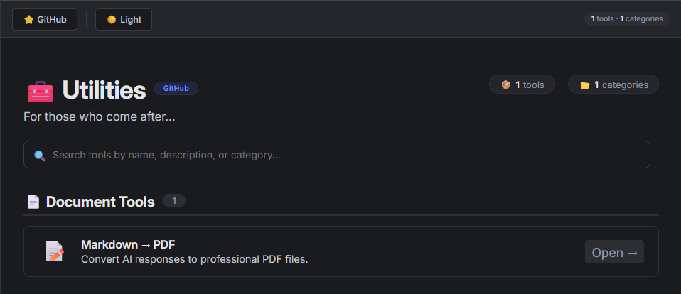
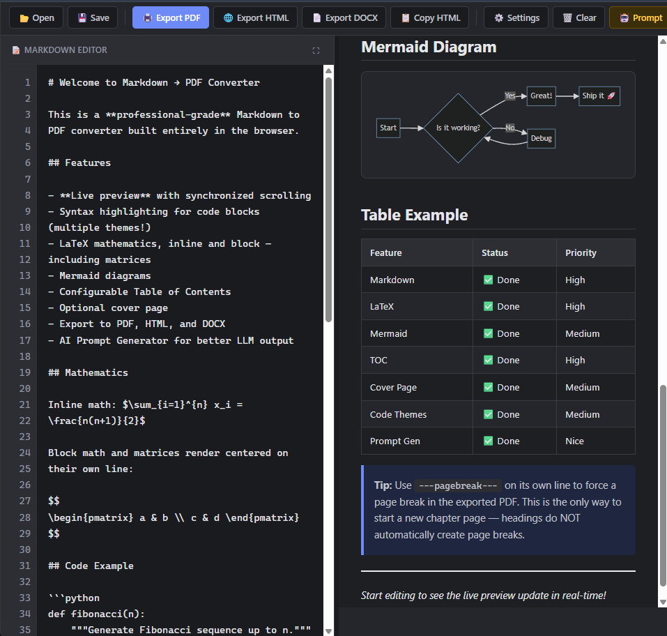

# 🛠 Utilities

> **A growing collection of tools built to solve everyday problems.**

  

Utilities is my personal toolbox.

Instead of relying on dozens of different websites for small tasks, I decided to build my own collection of utilities in one place. Every tool in this repository exists because I personally needed it, wanted to learn something new, or thought:

> *"There has to be a better way to do this."*

While this project started as a learning experience, its goal is much bigger:

**Create a fast, clean, and practical collection of utilities that anyone can use.**

---

# ✨ Philosophy

Every utility in this repository follows a few simple principles.

* ⚡ Fast and responsive
* 🎯 Solve one problem well
* 🧩 Simple to use
* 🚫 No unnecessary clutter
* 🔒 Privacy-friendly whenever possible
* 📈 Built to improve over time

Rather than creating dozens of half-finished tools, I'd rather build a smaller collection of utilities that are genuinely useful.

---

# 📸 Preview

## Home Page

  

---

## MD Studio

  

---

# 📦 Current Utilities

## 📝 MD Studio

> A modern Markdown editor focused on creating beautiful documents.

MD Studio combines writing, editing, previewing, and exporting into a single workspace.

### Features

* ✍️ Live Markdown editor
* 👀 Real-time preview
* 📄 Export to PDF
* 🌐 Export to HTML
* 📝 Export to DOCX
* 🧮 KaTeX math rendering
* 📊 Mermaid diagram support
* 🎨 Syntax highlighting
* 📑 Automatic Table of Contents
* 📋 Copy rendered HTML
* ⚙️ Document customization
* 🌙 Light & Dark mode
* 🤖 AI Prompt Library

---

# 🚀 Planned Utilities

Utilities is designed to grow over time.

Some ideas currently on my roadmap include:

* 🖼 Image utilities
* 📋 JSON formatter
* 📦 File conversion tools

...and many more as I encounter new problems worth solving.

---

# 🛠 Tech Stack

The technologies behind Utilities will continue evolving as I explore new frameworks and ideas.

---

# ❤️ Why I'm Building This

This project exists because I enjoy building software that I actually use.

Every new utility begins with the same question:

> **Would I personally use this every week?**

If the answer is yes, it deserves a place in this collection.

Some utilities might only save a few seconds.

Others might save hours.

Either way, they're worth building.

---

# 🌱 Learning Through Building

Utilities also serves as my learning playground.

Whenever I learn a new technology, framework, or concept, I try to apply it to a real project instead of leaving it as another completed tutorial.

Every utility teaches me something new.

Every commit represents progress.

---

# 🤝 Contributions

Ideas, suggestions, bug reports, and pull requests are always welcome.

If there's a utility you think would be useful, feel free to open an issue.

---

# ⭐ Support

If you find this project useful, consider giving it a star.

It helps others discover the project and motivates me to keep building new utilities.

---

## Build. Learn. Improve. Repeat.

For those who come after...

