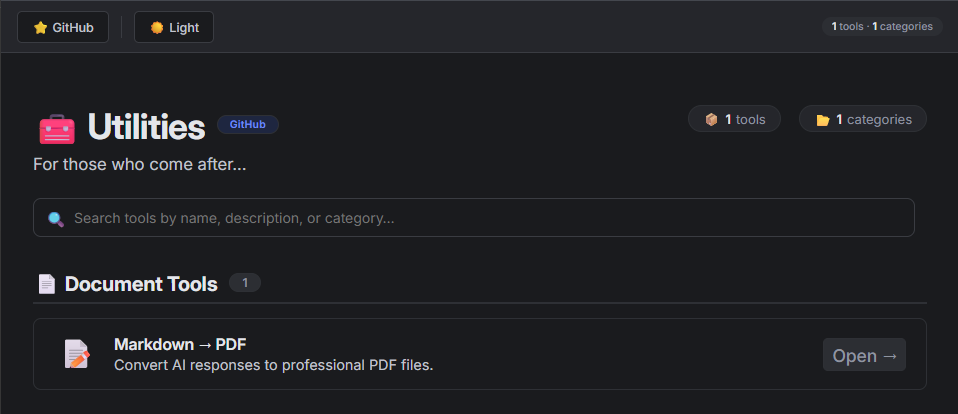
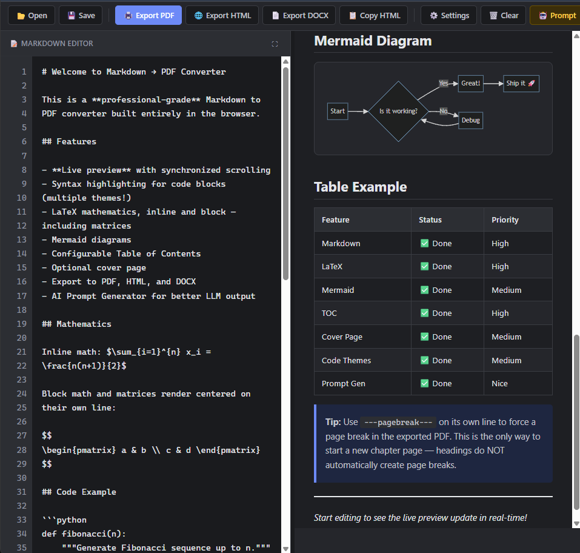

# 🛠 Utilities

> **A growing collection of tools built to solve everyday problems.**

<!-- 

  

 -->

Utilities is my personal toolbox.

Instead of relying on dozens of different websites for small tasks, I decided to build my own collection of utilities in one place. Every tool in this repository exists because I personally needed it, wanted to learn something new, or thought:

> *"There has to be a better way to do this."*

While this project started as a learning experience, its goal is much bigger:

**Create a fast, clean, and practical collection of utilities that anyone can use.**

---

# ✨ Philosophy

Every utility in this repository follows a few simple principles.

* ⚡ Fast and responsive
* 🎯 Solve one problem well
* 🧩 Simple to use
* 🚫 No unnecessary clutter
* 🔒 Privacy-friendly whenever possible
* 📈 Built to improve over time

Rather than creating dozens of half-finished tools, I'd rather build a smaller collection of utilities that are genuinely useful.

---

# 📸 Preview

## Home Page

  

---

## MD Studio

  

---

# 📦 Current Utilities

## 📝 MD Studio
> A modern Markdown editor focused on creating beautiful documents.

* ✍️ Live Markdown editor & real-time preview
* 📤 Streamlined export dropdown (PDF, Markdown, HTML, and Word DOC)
* ⌨️ Keyboard shortcuts: <kbd>Ctrl+S</kbd> saves Markdown, <kbd>Ctrl+P</kbd> exports PDF
* 🎨 5 professional cover page designs (Classic, Modern, Academic, Executive, Technical)
* 🔤 Rich typography with expanded Google Fonts and grouped categories
* 🖼️ Seamless image support: drag & drop into editor, direct clipboard paste (<kbd>Ctrl+V</kbd>), or insert modal (embedded into PDF & HTML)
* 🌐 Persian & Arabic support (B Nazanin with Persian digits, Vazirmatn, Amiri, Cairo, Noto Sans Arabic & smart RTL detection)
* 🧮 KaTeX math & 📊 Mermaid diagram support
* 🎨 Syntax highlighting & automatic Table of Contents
* 🌙 Light & Dark mode

---

## 📑 PDF to Markdown
> Fast, privacy-friendly in-browser PDF to Markdown conversion with smart layout analysis.

* 🧠 **Smart Layout & Hierarchy Detection**:
  * Dynamic heading detection (H1–H6) based on font metrics, weights, and spatial scaling
  * Multi-column text flow ordering (prevents interleaved column text in academic papers)
  * Smart paragraph stitching and automatic de-hyphenation across line wraps
  * Strips recurring running headers, footers, and page numbers
* 📊 **Table & Math Extraction**:
  * Converts structured data into clean GitHub-Flavored Markdown (GFM) tables
  * Recognizes mathematical notation and formats into KaTeX / LaTeX `$math$` and `$$equation$$`
  * Preserves monospace blocks as fenced code snippets with language hints
* 🖼️ **Image & Figure Extraction**:
  * Extracts embedded images, charts, and diagrams with high fidelity
  * Option to embed as inline Base64 data URIs or export as linked image assets
  * Image gallery inspector with resolution preview and individual downloads
* 👁️ **Interactive Dual/Triple View Studio**:
  * High-resolution PDF page viewer with zoom, rotation, page navigation, and X-Ray structural bounding box overlays
  * Live Markdown editor with line numbers, search & replace, and real-time formatted HTML preview
  * Side-by-side visual comparison between original PDF pages and generated Markdown
* 📦 **Flexible Export & Suite Integration**:
  * Export as `.md`, `.txt`, `.html`, or full `.zip` bundle (Markdown + images + metadata)
  * One-click "Open in MD Studio" for instant styling, Mermaid diagramming, and PDF/DOCX rendering
  * 100% client-side, offline-capable, and private (no files sent to external servers)

---

## 🛠️ PDF Workshop
> Fast, client-side PDF splitting and packaging tool. Divide multi-page documents into smaller PDF files and download as a ZIP.

* ✂️ **Splitting Methods**:
  * **Fixed Page Slicing (Every N Pages)**: Divide documents evenly into 5, 10, 20, or 50-page files with optional page boundary overlap.
  * **Custom Page Ranges**: Flexible syntax parser supporting custom page intervals (`1-5, 6-12, 13-end`).
  * **TOC & Chapter Slicing**: Automatically parses embedded bookmarks and outline trees to extract chapters.
  * **Single Page Burst**: Burst all pages into standalone 1-page PDF files.
* 📦 **Direct ZIP Download**:
  * Bundles all divided PDF files into a single `.zip` archive.
  * Individual chunk download option for targeted extraction.
* ⚡ **100% Client-Side & Private**:
  * Fast in-browser processing via PDF-Lib and PDF.js with zero server uploads.

---

## 🖼️ Image Forge
> Professional in-browser image editor, batch converter, and enhancement studio.

* 🔄 Convert between PNG, JPEG, WEBP, GIF, BMP, ICO, ICNS, SVG, and PDF
* 📐 Resize, smart crop, aspect fit/fill/contain, and dimension limits
* 🖋️ **Adobe Illustrator "Black and White Logo" Vector & Threshold Mode**:
  * Precision Rec.709 luminance thresholding with 0–255 parametric sensitivity
  * Despeckle / Noise reduction filter removing stray raster artifacts
  * Sub-pixel boundary smoothing to eliminate stair-stepping without blurring
  * "Ignore White" option for automatic transparent background generation
  * Direct vector tracing into pure SVG `<path>` elements without raster bloat
* 🎨 **Creative Effects & Filtering**:
  * Parametric Sharpening (Laplacian 3x3 convolution)
  * Radial Vignette with adjustable falloff curves
  * Posterization tone-reduction (2–16 steps)
  * Pixelate mosaic generator (2–32 px block size)
  * Emboss & Sobel 3x3 Edge Detection filters
  * Color grading presets (Vivid, Warm Golden, Cool Film, Noir B&W, Sepia, Cyberpunk, Invert)
* 🪄 Instant in-browser background removal (transparent alpha masking)
* 🔍 EXIF & Image Metadata inspector with privacy stripping on export
* ⚖️ Side-by-side & Interactive split-slider comparison with real-time effect preview
* 🌈 Auto-extracted dominant 7-color HEX palette with one-click copy
* 🔒 100% client-side processing (no server uploads)

---

## 🎵 Audio Forge
> Professional in-browser audio editor, waveform trimmer, and music converter.

* 🔄 Convert between MP3 (64–320 kbps), WAV (16-bit PCM, 24-bit studio, 32-bit float), WebM, and OGG Opus
* 🏷️ ID3 Tag & Song Metadata Editor: Title, Artist, Album, Year, Genre, Track #, and Album Cover art embedding
* ✂️ Visual dual-channel waveform editor with precision trimming, region cutting, and zoom (1x to 8x)
* 🎚️ 3-Band Equalizer (Bass, Mid, Treble) & Low-Pass / High-Pass filters with audio presets
* ⚡ Peak & safe volume normalization (-24 dB to +24 dB gain) with fade-in and fade-out
* 🚀 Tempo/speed stretching (0.25x - 3.0x), reverse audio playback, and center vocal remover
* 🎙️ Live microphone recording with oscilloscope & synthesizer tone generator
* 📦 Batch audio conversion with one-click ZIP bundle export
* 🔒 100% private client-side processing (GitHub Pages ready)

---

## 🎙️ Persian Text to Speech
> Professional Persian (Farsi) text-to-speech synthesis, speech recognition, and live audio transcription studio.

* 🎙️ **Speech-to-Text (تبدیل گفتار به متن)**:
  * Continuous and single-phrase Persian speech recognition powered by Web Speech API (`fa-IR` and `fa-AF`)
  * Live audio visualizer oscilloscope canvas via Web Audio API (`AnalyserNode`)
  * Real-time provisional speech display and auto-punctuated transcription
  * Pre-recorded audio file transcription (`.mp3`, `.wav`, `.m4a`, `.ogg`, `.webm`)
  * Multi-format document export: download transcripts as Word Document (`.doc`), Markdown (`.md`), or Plain Text (`.txt`)
* ✍️ **Persian Typography & Text Polish**:
  * Auto-normalization of standard Persian half-spaces (*نیم‌فاصله* like `می‌شود` and `کتاب‌ها`)
  * Bidirectional Persian and Latin number conversion (`۱۲۳۴۵` ↔ `12345`)
  * Smart Persian punctuation fixing (`،`, `؟`, `؛`, and `«»` quotation marks)
  * Real-time Persian word count, character count, and speech reading time calculation
* 🔊 **Text-to-Speech (تبدیل متن به گفتار)**:
  * 100% client-side Persian speech synthesis with voice picker (native browser voices, zero API keys required)
  * Dynamic speech parameter adjustments (Rate 0.5x–2.0x, Pitch 0.5–1.5, Volume 0–100%)
  * Play, Pause, Resume, and Stop controls with live audio equalizer bar animations
  * Curated Persian literature presets: Hafez, Saadi, conversational Persian, tech prose, and tongue twisters
  * Download synthesized speech and microphone recordings directly as `.wav` files
* 🔄 **Two-Way Voice Studio**:
  * Unified speech-to-text-to-speech feedback loop for dictation and voice rehearsal
  * Clean, streamlined interface focused on productivity without clutter

---

## 🔳 QR Forge
> Complete QR code design studio, batch generator, and live scanner — 100% client-side with zero data leakage.

* 🎨 **Designer & Customization Engine**:
  * 6 Dot patterns: Classic Square, Smooth Dots, Rounded, Extra-Rounded, Classy, Classy-Rounded
  * Independent Finder Eye patterns: Square, Circle, and Extra-Rounded corner frames and dots
  * Color options: Solid foreground, Linear and Radial gradients with custom angles, and independent corner colors
  * Transparent background support for graphic design and print overlay
  * 8 curated designer palettes (Classic, Tech Indigo, Cyber Emerald, Sunset, Midnight, Deep Purple, Slate, Ocean)
* 🏷️ **CTA Frames & Badges**:
  * Customizable "SCAN ME", "CONNECT TO WI-FI", or custom text banners
  * Top and bottom banner frames, phone mockup card frame, and ticket borders with customizable colors and typography
* 🖼️ **Logo & Icon Embedding**:
  * Built-in vector icons: Wi-Fi, Globe, GitHub, Twitter/X, Instagram, YouTube, LinkedIn, WhatsApp, Email, Phone, Bitcoin, Shield, Star, Heart
  * Custom logo upload (PNG, JPG, SVG) with adjustable size, padding, and background clear-out
  * Automatic Error Correction Level bump to High (`H` 30%) when logos are added to guarantee 100% scannability
* 📋 **12 Data Type Templates**:
  * **URL & Web**: with integrated UTM campaign parameters builder
  * **Wi-Fi Network**: WPA/WPA2/WPA3, WEP, or Open network with SSID and password (instant 1-tap connection)
  * **vCard 3.0 Contact**: Full name, company, job title, phone numbers, email, address, and notes
  * **WhatsApp & SMS**: Phone number with prefilled message
  * **Email & Phone**: `mailto:` with subject/body and direct dial `tel:`
  * **iCal Calendar Event**: Title, dates, location, and description for instant calendar import
  * **Geo / Maps**: Coordinates with "Use My Location" GPS integration
  * **Crypto**: Bitcoin, Ethereum, Solana, USDT, Dogecoin with addresses and amounts
  * **Social**: Presets for Instagram, Twitter/X, GitHub, YouTube, LinkedIn, Telegram, TikTok
  * **Plain Text**: Arbitrary notes, markdown, and JSON payloads
* 📦 **Batch QR Generator**:
  * Bulk generate up to 500 QR codes from multi-line text or uploaded `.csv` / `.txt` files
  * Live batch preview gallery with individual downloads
  * One-click "Download All as ZIP" archive powered by JSZip
* 📷 **QR Code Scanner & Decoder**:
  * Live webcam / camera scanning with viewfinder reticle and camera switcher
  * Drag-and-drop / paste (`Ctrl+V`) image decoder powered by `jsQR`
  * Actionable result inspector (open links, connect to Wi-Fi, download `.vcf` contact card, or copy text)
  * "Load into Designer" button to instantly restyle scanned QR codes
* 📤 **Multi-Format High-Res Exports**:
  * PNG at 512px, 1024px, 2048px, or 4096px print-ready resolution
  * Pure vector SVG export for Figma, Illustrator, and laser engraving
  * Direct 1-click clipboard copy (`image/png` blob) and clean print view

---

## 🗂️ File Forge
> Batch file renaming, organization, and asset manager.

* 🏷️ Batch rename with prefixes, suffixes, and regex
* 🔢 Auto-numbering and case transformations
* 📦 Package and download processed files into a ZIP archive

---

## 📲 File Transfer
> Fast, private PC ↔ Mobile peer-to-peer file transfer with live auto-synchronization.

* 🌐 **GitHub Pages Ready**: Powered by WebRTC DataChannels with zero cloud storage
* 🔢 **4-Digit Quick Code**: Pair PC to PC instantly by entering a 4-digit code
* 📷 Scan QR code to pair phone and PC instantly
* ⚡ Direct chunked streaming with real-time transfer progress
* 💬 **Quick Text Clipboard & Chat**: Simple real-time chatroom to type text/links on your phone and copy them with one click on your laptop (or vice versa), each message featuring an instant copy button
* 🔄 **Instant Auto-Sync Signals**: Connected devices automatically refresh whenever an upload is completed
* ↻ **Manual Refresh**: Quick-action refresh button to instantly fetch and verify newly uploaded content
* 🔒 End-to-end private transfer

---

## 🔍 WebScope
> Website intelligence and reconnaissance for AI agents and developers.

* 📡 Inspect website assets, scripts, and endpoints
* 🔎 Correlate known variables with network responses
* 📦 Package evidence bundles directly into downloadable ZIPs

---

## 🧰 Secret Lab
> Developer security, token analysis, cryptography, and encoder studio — 100% client-side with zero data leakage.

* 🔑 **JWT Inspector**:
  * Color-coded header, payload, and signature breakdown
  * Live token lifecycle analysis: human-readable expiration countdown (`exp`), issued-at (`iat`), and not-before (`nbf`) claims
  * Local HMAC-SHA256 signature verification with custom secret keys (zero external network requests)
* ⚡ **Hash & HMAC Studio**:
  * Real-time calculation of SHA-256, SHA-512, MD5, and SHA-1 digests
  * Dual-mode input: live UTF-8 text string and drag-and-drop file hasher
  * HMAC-SHA256 and HMAC-SHA512 calculation with secret key
  * Instant hash comparator to verify expected file checksums
* 🔄 **Universal Codec & Encoder**:
  * UTF-8 safe Base64, Base64URL (RFC 4648), Hexadecimal, URL component encoding, HTML entities, 8-bit Binary, and ROT13
  * 1-click bidirectional input/output swap with validation error handling
* 🎲 **Cryptographic Key & UUID Generator**:
  * RFC-compliant UUIDv4 and timestamp-ordered UUIDv7 (Unix Epoch)
  * NanoID (21 URL-safe chars), API keys with custom prefixes (`sk_live_...`), and raw cryptographic hex secrets (32 bytes)
  * High-entropy Diceware multi-word passphrases with custom separators and capitalization
  * Batch generation with 1-click "Copy All" and `.txt` download
* 🧪 **Interactive Regex Playground**:
  * Pattern testing with real-time colored match highlighting and match counters
  * Capture groups breakdown table ($1, $2, …) with indices
  * Live substitution / replace output preview
  * Built-in cheat sheet presets: Email, URL, IPv4, ISO Date, Hex Color, Slug, and SemVer
* 🔐 **Client-Side AES-GCM-256 Vault**:
  * In-browser symmetric encryption with PBKDF2 key derivation (100,000 iterations, SHA-256)
  * Random 16-byte salt and 12-byte IV for military-grade protection
  * Formatted JSON encrypted payload export and instant decrypt verification

---

## 🎯 AutoScope — Automation & Site Intelligence (Chrome Extension v2.0)
> Advanced in-browser automation inspector and reconnaissance studio for Playwright, Puppeteer, Selenium, and Python bots.

* 🧠 **Deep Site & Environmental Intelligence**:
  * SPA framework & architecture detection (React, Next.js, Vue, Nuxt, Angular, Svelte, jQuery, Tailwind, Bootstrap)
  * iFrame & cross-origin boundary mapping with `page.frameLocator(...)` snippets
  * Modal, dialog, and popover state tracking (`[aria-modal="true"]`, `<dialog>`)
  * Live viewport metrics, device pixel ratio, document dimensions, and storage counters
* 🎯 **Multi-Strategy Resilient Selectors**:
  * Prioritizes Playwright best practices: `page.getByTestId()`, `page.getByRole()`, `page.getByLabel()`, `page.getByPlaceholder()`, `page.getByText()`
  * Unique verified CSS paths evaluated against DOM uniqueness
  * Semantic XPaths (`//button[normalize-space()='...']`, `//input[@name='...']`)
  * Code-ready action snippets: `await page.click()`, `await page.fill()`, `await page.check()`
* 🖥️ **Interactive In-Page Automation HUD & Live Inspector**:
  * Non-intrusive floating dock with Inspector, Insights, and Quick Export panes
  * Real-time element highlight box with live dimension badge (`width × height px`)
  * Quick 1-click clipboard copy for Playwright, CSS, XPath, and Python snippets
  * Keyboard shortcut: `Esc` to toggle live inspector on and off
* 📦 **Comprehensive Export Formats**:
  * **Automation Dossier (`.md`)**: Full structural Markdown report with tables, action guides, and frame warnings
  * **Automation Spec (`.json`)**: Machine-readable schema for AI coding agents and automated scrapers
  * **Playwright Test Scaffolding (`.spec.ts`)**: Runnable test script ready for `npx playwright test`
  * **Python Playwright Script (`automate.py`)**: Synchronous script template ready to execute

---

# 🚀 Planned Utilities

Utilities is designed to grow over time.

Some ideas currently on my roadmap include:

* 🖼 Image utilities
* 📋 JSON formatter
* 📦 File conversion tools

...and many more as I encounter new problems worth solving.

---

# 🛠 Tech Stack

The technologies behind Utilities will continue evolving as I explore new frameworks and ideas.

---

# ❤️ Why I'm Building This

This project exists because I enjoy building software that I actually use.

Every new utility begins with the same question:

> **Would I personally use this every week?**

If the answer is yes, it deserves a place in this collection.

Some utilities might only save a few seconds.

Others might save hours.

Either way, they're worth building.

---

# 🌱 Learning Through Building

Utilities also serves as my learning playground.

Whenever I learn a new technology, framework, or concept, I try to apply it to a real project instead of leaving it as another completed tutorial.

Every utility teaches me something new.

Every commit represents progress.

---

# 🤝 Contributions

Ideas, suggestions, bug reports, and pull requests are always welcome.

If there's a utility you think would be useful, feel free to open an issue.

---

# ⭐ Support

If you find this project useful, consider giving it a star.

It helps others discover the project and motivates me to keep building new utilities.

---

# 📜 License

This project is licensed under the MIT License.

See the [LICENSE](LICENSE) file for details.

---

## Build. Learn. Improve. Repeat.

For those who come after...

